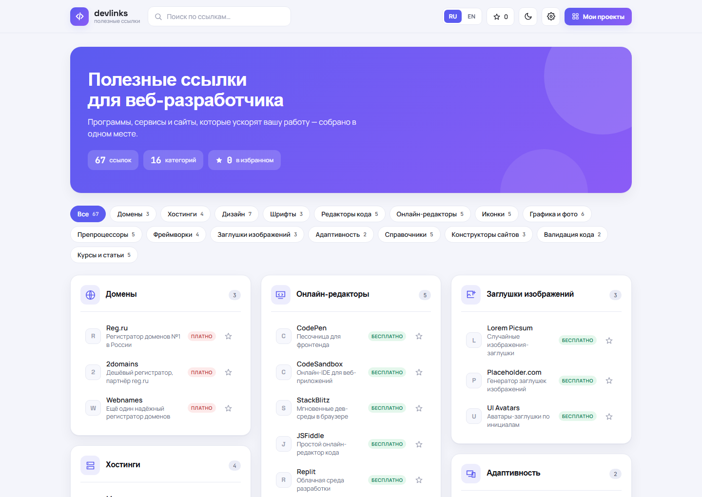

<div align="center">

# devlinks

**Каталог инструментов для веб-разработчика — и витрина моих проектов.**

67 проверенных сервисов в 16 категориях, двуязычный интерфейс, избранное,
тёмная тема и приватная админка на PIN. Без сборки, без фреймворк-тулинга,
без базы данных.

[**Открыть сайт →**](https://azatmursiev.com/links/)

[](https://azatmursiev.com/links/)
[](LICENSE)




</div>

---

## Что это

Каждый разработчик собирает свой набор закладок: где регистрировать домен, где
брать шрифты, чем сжимать картинки, какой генератор заглушек не отвалился за год.
Обычно это хаос в браузере. `devlinks` — та же подборка, но с поиском,
категориями, избранным и пометкой «бесплатно / платно» у каждой ссылки.

Вторая половина проекта — раздел «Мои проекты»: список моих работающих сайтов
с описанием и стеком. Часть записей помечена как личные — они **не отдаются
анонимному посетителю** и видны только мне после входа по PIN.

> Первую версию этой идеи я собрал в 2022 году — статическая страница без
> бэкенда, она до сих пор жива:
> [azatmursiev.github.io/links-2022](https://azatmursiev.github.io/links-2022/).
> Текущая версия — переосмысление той же задачи четыре года спустя.

## Возможности

| | |
|---|---|
| 🔍 **Живой поиск** | Мгновенная фильтрация по названию и описанию, по всем 16 категориям |
| 🌐 **RU / EN** | Полный перевод интерфейса и описаний, переключатель в шапке |
| ⭐ **Избранное** | Сохраняется в `localStorage`, отдельная вкладка-фильтр |
| 🌗 **Тёмная тема** | Ручной переключатель, выбор запоминается |
| 💸 **Метки тарифов** | У каждой ссылки — «бесплатно» или «платно» |
| 🗂 **Мои проекты** | Модалка со списком сайтов: статус, стек, год, ссылка |
| 🔒 **Приватные записи** | `"private": true` → видно только админу, фильтрация на сервере |
| ⚙️ **Админка на PIN** | Правка каталога и проектов прямо из браузера, без правки кода |
| 📱 **Адаптив** | От 320px: шапка не переносится, подписи кнопок ужимаются |

## Как устроено

Ключевое архитектурное решение — **разделение веб-корня и приватного хранилища**.
Ни админ-панель, ни хэш PIN, ни список личных проектов физически не лежат в папке,
которую отдаёт nginx. Даже при ошибке в конфиге веб-сервера их нельзя получить
прямой ссылкой — их там просто нет.

```
                                  ┌─────────────────────────────┐
   браузер ──── GET /links/ ────► │  /var/www/mywebsite/links/  │  ← веб-корень
                                  │                             │    (публично)
                                  │  index.html   catalog.js    │
                                  │  support.js   icons/        │
                                  │  login.php    logout.php    │
                                  │  admin.php    projects.php  │
                                  └──────────────┬──────────────┘
                                                 │ require / readfile
                                                 │ (только из PHP)
                                  ┌──────────────▼──────────────┐
                                  │  /var/www/links-private/    │  ← вне веб-корня
                                  │                             │    www-data, 750
                                  │  auth.php      (bcrypt PIN) │
                                  │  panel.html    (HTML админки)│
                                  │  projects.json (все проекты)│
                                  │  throttle.json (блокировки) │
                                  └─────────────────────────────┘
```

**Поток авторизации**

1. `login.php` — форма на 4 цифры, автоотправка по последнему символу.
   Проверка через `password_verify()` против bcrypt-хэша; сам PIN никуда не пишется.
2. Брутфорс: 4 цифры — это всего 10 000 комбинаций, поэтому после **5 неудач**
   вход блокируется на **60 секунд** (состояние в `throttle.json`).
3. Сессия — кука `DLADMIN`: `httponly`, `secure`, `path=/links/`, `SameSite=Lax`,
   TTL 12 часов.
4. `admin.php` — не страница, а **шлюз**: проверяет сессию и отдаёт `panel.html`
   через `readfile()` из приватной папки. Без сессии — редирект на вход.

**API проектов — `projects.php`**

- `GET` возвращает список. Без сессии приватные записи **вырезаются на сервере**
  (`array_filter` по флагу `private`), а не прячутся стилями на клиенте.
- `POST` перезаписывает список целиком, без сессии — `403`.
- CSRF закрыт самим `SameSite=Lax`: кросс-сайтовый POST не несёт сессионную куку,
  поэтому отдельный токен не нужен.
- Запись атомарная: `file_put_contents()` во временный файл с `LOCK_EX`, затем
  `rename()` — оборванный запрос не оставит битый JSON.
- Ответ помечен `Cache-Control: no-store, private` и `X-Robots-Tag: noindex`.
- Заголовок `X-DL-Auth: 1|0` говорит фронтенду, вошёл ли админ — по нему
  подсвечивается шестерёнка и появляется плашка «видны личные проекты».

## Структура

```
index.html          главная страница
catalog.js          данные каталога + утилиты (единый источник правды)
support.js          рантайм рендеринга (вендорный, не редактируется)
login.php           экран входа по PIN
admin.php           сессионный шлюз к админ-панели
logout.php          выход
projects.php        API проектов (GET/POST)
icons/              фавиконки
examples/           шаблоны приватных файлов для развёртывания
docs/               скриншоты для README
```

Приватная часть (`auth.php`, `panel.html`, `projects.json`, `throttle.json`)
**в репозиторий не входит** — её шаблоны лежат в [`examples/`](examples/).

## Запуск локально

Нужен только PHP 8.1+ со встроенным сервером — ни npm, ни composer, ни БД.

```bash
git clone https://github.com/azatmursiev/devlinks.git && cd devlinks
```

Создайте приватную папку рядом с проектом и положите туда конфиг:

```bash
mkdir -p ../links-private
cp examples/auth.example.php ../links-private/auth.php
cp examples/projects.example.json ../links-private/projects.json
```

Задайте свой PIN — сгенерируйте хэш и подставьте его в `DL_PIN_HASH`:

```bash
php -r 'echo password_hash("1234", PASSWORD_DEFAULT), PHP_EOL;'
```

В `auth.php`, `admin.php` и `projects.php` абсолютные пути вида
`/var/www/links-private/...` замените на путь к созданной папке, затем:

```bash
php -S localhost:8000
```

Сайт — `http://localhost:8000/`, админка — `http://localhost:8000/login.php`.

> Локально кука сессии выставлена с флагом `secure`, поэтому по `http://`
> вход не удержится. Для проверки админки либо снимите `'secure' => true`
> в локальной копии `auth.php`, либо поднимите HTTPS.

## Развёртывание

```
/var/www/mywebsite/links/   root:root       755 / 644   ← публичные файлы
/var/www/links-private/     www-data:www-data 750 / 640  ← приватные файлы
```

nginx: `location ^~ /links/` с передачей `.php` в `php8.1-fpm`, плюс
`absolute_redirect off` в блоке `server{}` — иначе запрос `/links` без слэша
за Cloudflare редиректит на внутренний порт.

> **Кеш Cloudflare.** Статика (`.js`) кешируется на краю, поэтому импорт
> каталога версионируется — `catalog.js?v=N`. После правки данных бампайте
> версию в `index.html` **и** в `panel.html`, иначе часть посетителей
> продолжит получать старую копию.

## Безопасность

Чего в этом репозитории нет и не будет:

- `auth.php` с боевым bcrypt-хэшем — 4-значный PIN перебирается по хэшу за
  считанные часы, публикация хэша равносильна публикации самого PIN;
- `projects.json` с реальными записями, включая приватные;
- `throttle.json`, ключи, `.env`, любые доступы к серверу.

Всё перечисленное закрыто в [`.gitignore`](.gitignore) на уровне папки `_private/`,
а в репозитории лежат только обезличенные шаблоны.

## Стек

Ванильный JavaScript (ES-модули) и CSS-переменные на фронтенде, PHP 8.1 без
фреймворка на бэкенде, хранение — JSON-файл и `localStorage`. Ни сборки,
ни зависимостей, ни базы данных: страница открывается из файловой системы,
а весь бэкенд — четыре PHP-файла суммарно меньше 400 строк.

Визуальный слой собран в Claude Design: `index.html` и `panel.html` — это
`.dc.html`-документы, которые исполняет вендорный рантайм `support.js`
(он подгружает React с CDN). Рантайм сгенерирован, правки вносятся
в разметку и в `catalog.js`.

## Лицензия

[MIT](LICENSE) — Azat Mursiev, 2026.

Лицензия распространяется на код. Ссылки в каталоге ведут на сторонние сервисы,
права на них принадлежат их владельцам.

---

<div align="center">
<sub><a href="https://azatmursiev.com">azatmursiev.com</a> · <a href="https://azatmursiev.com/links/">devlinks</a></sub>
</div>
